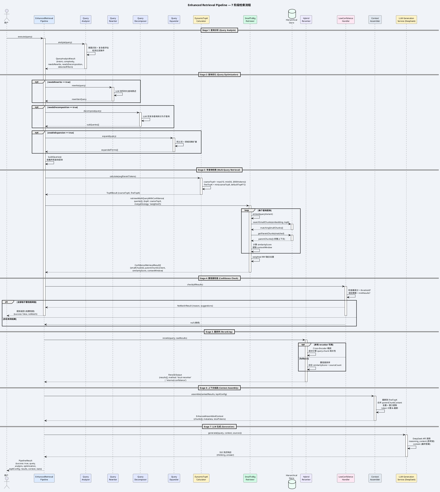

# 增强检索流水线 (Enhanced Retrieval Pipeline)

## 各阶段职责

| 阶段 | 组件 | 核心功能 | 输出 |
|------|------|---------|------|
| **1. 分析** | QueryAnalyzer | 意图识别、复杂度评估、过滤条件检测 | QueryAnalysisResult |
| **2. 优化** | Rewriter + Decomposer + Expander | 查询改写、子查询分解、术语扩展 | QueryOptimizationOutput |
| **3. 检索** | DynamicTopK + SmallToBigRetriever | 自适应K值、多查询加权融合检索 | ConfidenceRetrievalResult[] |
| **4. 检查** | LowConfidenceHandler | 低置信度检测，提前返回或继续 | NoMatchResult / null |
| **5. 重排** | HybridReranker | Cross-Encoder精排 或 置信度排序 | RerankOutput |
| **6. 组装** | EnhancedContextAssembler | 截断、合并、去重、token计数 | EnhancedAssembledContext |
| **7. 生成** | LLM Generation Service | DeepSeek 思考链 + 答案生成 (SSE) | {thinking, answer} |
