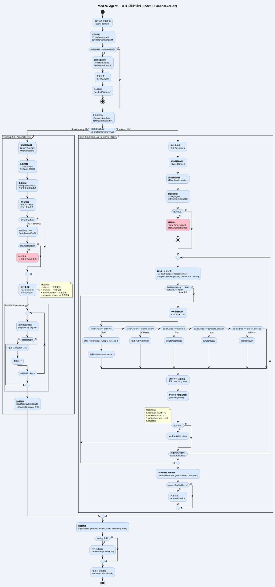

# 医疗 Agent 执行流程 (Medical Agent Execution Flow)



## 执行模式对比

| 特性 | ReAct 模式 | Planning 模式 |
|------|-----------|--------------|
| **适用场景** | 简单/中等复杂度查询 | 高复杂度、多实体对比分析 |
| **决策方式** | Think→Act→Observe→Decide 循环 | DAG 任务图 → 并行执行 |
| **最大迭代** | maxIterations (默认5) | maxReplanRounds (默认2) |
| **实体覆盖** | 规则化判断 (4条规则) | DAG 完成后直接生成 |
| **并行能力** | 串行执行 | DAG 并行组 |
| **失败回退** | N/A | 自动回退到 ReAct 模式 |

## 关键决策点

### 模式选择 (chooseExecutionMode)
```
enablePlanning == false → ReAct
复杂度评估 needsPlanning == false → ReAct
复杂度评估 needsPlanning == true → Planning
```

### 早期终止条件
1. **绝对禁忌**：安全预检查发现 absolute 级别禁忌 → 跳过循环直接生成警告
2. **低置信度**：实体识别置信度 < lowConfidenceThreshold (默认0.3) → 跳过循环直接检索
3. **迭代耗尽**：达到 maxIterations → 强制生成答案
