# WebSocket 事件流 (WebSocket Event Flow)

```plantuml
@startuml
skinparam backgroundColor #f0f4f8
skinparam defaultFontSize 10
skinparam sequenceMessageAlign center

title WebSocket — 实时事件推送时序图

participant "Pipeline\n(Harness)" as Pipeline
participant "Pipeline\nEmitter" as Emitter
participant "WebSocket\nHandler" as WSHandler
participant "Fastify\nWebSocket Route" as WSRoute
participant "前端\nReact App" as Frontend
participant "Stats\nAggregation" as StatsAgg
participant "Alert\nHandler" as Alert

== Pipeline 执行阶段事件 ==

Pipeline -> Emitter: onStageStart("ingest")
Emitter -> WSHandler: broadcast({type: "stage:start", stage: "ingest"})
WSHandler -> WSRoute: 遍历所有连接客户端
WSRoute -> Frontend: {type: "stage:start", stage: "ingest", timestamp}

Pipeline -> Emitter: onStageComplete("ingest")
Emitter -> WSHandler: broadcast({type: "stage:complete", stage: "ingest", metrics})
WSHandler -> WSRoute: 遍历所有连接客户端
WSRoute -> Frontend: {type: "stage:complete", stage: "ingest", durationMs, ...}

Pipeline -> Emitter: onStageStart("parse")
Emitter -> WSHandler: broadcast({type: "stage:start", stage: "parse"})
WSHandler -> WSRoute: broadcast
WSRoute -> Frontend: {type: "stage:start", stage: "parse"}

note right of Frontend
  **前端状态更新:**
  PipelineTimeline 组件
  更新 StageCard 状态为 "进行中"
end note

Pipeline -> Emitter: onStageComplete("parse")
Emitter -> WSHandler: broadcast({type: "stage:complete", stage: "parse"})
WSHandler -> WSRoute: broadcast
WSRoute -> Frontend: {type: "stage:complete", stage: "parse"}

== Chunk 创建事件 ==

Pipeline -> Emitter: chunkCreated(chunk)
Emitter -> WSHandler: broadcast({type: "chunk:created", chunkId, parentId, content})
WSHandler -> WSRoute: broadcast
WSRoute -> Frontend: {type: "chunk:created", chunk: {...}}

note right of Frontend
  **前端状态更新:**
  ChunkExplorer 组件
  实时添加新分块节点到树形视图
end note

== 检索阶段事件 ==

Pipeline -> Emitter: retrievalStarted(query)
Emitter -> WSHandler: broadcast({type: "retrieval:start", query})
WSHandler -> WSRoute: broadcast
WSRoute -> Frontend: {type: "retrieval:start", query: "..."}

note right of Frontend
  **前端状态更新:**
  RetrievalFlow 组件
  显示检索动画 + 检索词
end note

Pipeline -> Emitter: retrievalMatched(result)
Emitter -> WSHandler: broadcast({type: "retrieval:match", result})
WSHandler -> WSRoute: broadcast
WSRoute -> Frontend: {type: "retrieval:match", chunkId, similarityScore}

Pipeline -> Emitter: retrievalComplete(results[])
Emitter -> WSHandler: broadcast({type: "retrieval:complete", results, totalCount})
WSRoute -> Frontend: {type: "retrieval:complete", results[], totalCount}

== LLM 生成阶段事件 ==

Pipeline -> Emitter: generationStarted()
Emitter -> WSHandler: broadcast({type: "generation:start"})
WSHandler -> WSRoute: broadcast
WSRoute -> Frontend: {type: "generation:start"}

note right of Frontend
  **前端状态更新:**
  ChatWindow 组件
  显示 "思考中..." 动画
end note

Pipeline -> Emitter: thinkingChunk(text)
Emitter -> WSHandler: broadcast({type: "generation:thinking", text})
WSHandler -> WSRoute: broadcast
WSRoute -> Frontend: {type: "generation:thinking", text: "分析资料中的..."}

note right of Frontend
  **前端状态更新:**
  ThinkingChainDisplay 组件
  实时展开思考过程
end note

Pipeline -> Emitter: answerChunk(text)
Emitter -> WSHandler: broadcast({type: "generation:answer", text})
WSHandler -> WSRoute: broadcast
WSRoute -> Frontend: {type: "generation:answer", text: "根据文档..."}

note right of Frontend
  **前端状态更新:**
  AnswerCard 组件
  逐字/逐句流式渲染答案
end note

Pipeline -> Emitter: generationComplete({thinking, answer})
Emitter -> WSHandler: broadcast({type: "generation:complete", thinking, answer})
WSHandler -> WSRoute: broadcast
WSRoute -> Frontend: {type: "generation:complete", thinking, answer}

== 统计更新事件 (定时推送) ==

StatsAgg -> Emitter: statsUpdated(stats)
Emitter -> WSHandler: broadcast({type: "stats:update", stats})
WSHandler -> WSRoute: broadcast
WSRoute -> Frontend: {type: "stats:update", documentCount, chunkCount, ...}

note right of Frontend
  **前端状态更新:**
  StatsDashboard 组件
  更新 StatCard / 图表数据
  (每5秒推送一次)
end note

== 告警事件 ==

Alert -> Emitter: alertTriggered(alert)
Emitter -> WSHandler: broadcast({type: "alert:triggered", alert})
WSHandler -> WSRoute: broadcast
WSRoute -> Frontend: {type: "alert:triggered", alertType, message, severity}

note right of Frontend
  **前端状态更新:**
  AlertCard 组件
  显示告警通知
end note

== Pipeline 完成事件 ==

Pipeline -> Emitter: pipelineComplete(result)
Emitter -> WSHandler: broadcast({type: "pipeline:complete", status, metrics})
WSHandler -> WSRoute: broadcast
WSRoute -> Frontend: {type: "pipeline:complete", status: "success", totalDurationMs}

== 启动阶段事件 ==

Pipeline -> Emitter: startupProgress({stage, progress})
Emitter -> WSHandler: broadcast({type: "startup:progress", startupStage, progress, message})
WSHandler -> WSRoute: broadcast
WSRoute -> Frontend: {type: "startup:progress", startupStage: "model", progress: 0.5}

note right of Frontend
  **前端状态更新:**
  StartupProgress 组件
  显示模型加载进度条
end note

Pipeline -> Emitter: startupReady()
Emitter -> WSHandler: broadcast({type: "startup:ready", message})
WSRoute -> Frontend: {type: "startup:ready", message: "Server ready"}

@enduml
```

## 事件类型总览

| 事件类型 | 触发时机 | 前端消费组件 |
|---------|---------|------------|
| `stage:start` | 每个 Pipeline Stage 开始时 | PipelineTimeline → StageCard |
| `stage:complete` | 每个 Pipeline Stage 完成时 | PipelineTimeline → StageCard |
| `chunk:created` | 语义分块完成，创建新 Chunk | ChunkExplorer → TreeNode |
| `retrieval:start` | 用户发起检索查询时 | RetrievalFlow / ChatWindow |
| `retrieval:match` | 每个匹配结果返回时 | RetrievalFlow → AnimatedFlowLine |
| `retrieval:complete` | 检索完成，所有结果汇总 | RetrievalResultPanel |
| `generation:start` | LLM 开始生成时 | ChatWindow → StreamingIndicator |
| `generation:thinking` | 思考链内容流式推送 | ThinkingChainDisplay |
| `generation:answer` | 答案内容流式推送 | AnswerCard / ChatWindow |
| `generation:complete` | LLM 生成完成 | ChatWindow / EvidencePanel |
| `stats:update` | 定时聚合推送（每5秒） | StatsDashboard → StatCard |
| `alert:triggered` | 告警条件触发时 | AlertCard |
| `pipeline:complete` | 整个 Pipeline 执行完成 | PipelineVisualizer |
| `startup:progress` | 模型预加载进度更新 | StartupProgress |
| `startup:ready` | 服务器就绪 | ConnectionIndicator |
| `startup:error` | 模型预加载失败 | StartupProgress |
| `error` | 服务器错误/关闭 | ConnectionIndicator |
