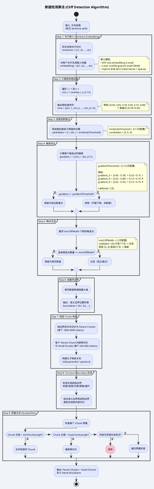

# 语义分块算法 (Semantic Chunking — Cliff Detection)

## 算法参数配置

| 参数 | 默认值 | 说明 |
|------|--------|------|
| `similarityThreshold` | 0.7 | 余弦相似度低于此值视为候选断崖 |
| `gradientThreshold` | 0.15 | 相邻相似度变化幅度阈值 |
| `minCliffWidth` | 2 | 最小连续断崖点数（过滤噪点） |
| `parentChunkTokens` | 1000-2000 | 父块大小范围 |
| `smallChunkTokens` | 200-500 | 子块大小范围 |
| `minChunkLength` | 50 chars | 最小分块长度（低于则合并） |
| `maxChunkLength` | 4000 chars | 最大分块长度（超过则强制再切） |

## 设计原理

1. **断崖检测** 基于语义相似度突变，而非固定长度 —— 保持上下文完整性
2. **梯度验证** 区分真正的主题切换和自然的话题漂移
3. **噪点过滤** 避免因个别句子异常导致的过度切分
4. **结构边界融合** 结合文档格式（标题/表格/列表）避免破坏文档结构
5. **Small-to-Big** 层级设计：小块精准检索 + 大块完整上下文
