# 数据模型类图 (Data Model — UML Class Diagram)

```plantuml
@startuml
skinparam backgroundColor #f0f4f8
skinparam defaultFontSize 10
skinparam classBackgroundColor #dbeafe
skinparam classBorderColor #3b82f6

title SelfSearchRAG — 核心数据模型

' === 文档处理领域 ===

class Document {
  + id: string
  + name: string
  + path: string
  + format: string
  + status: DocumentStatus
  + pageCount: number
  + metadata: Record<string, unknown>
  + uploadTime: Date
}

enum DocumentStatus {
  PENDING
  INGESTING
  PARSING
  CHUNKING
  EMBEDDING
  INDEXING
  READY
  FAILED
}

class Context {
  + document: Document
  + state: ProcessingState
  + artifacts: Map<string, unknown>
  + errors: PipelineError[]
  + stageMetrics: Map<string, StageMetrics>
  + setState(state: ProcessingState)
  + addArtifact(key: string, value: unknown)
  + addError(error: PipelineError)
  + getErrors(): PipelineError[]
  + getAllStageMetrics(): Map<string, StageMetrics>
}

class PipelineResult {
  + documentId: string
  + status: 'success' | 'failed' | 'partial'
  + context: Context
  + metrics: ExecutionMetrics
  + errors: PipelineError[]
}

class ExecutionMetrics {
  + totalDurationMs: number
  + stageMetrics: Map<string, StageMetrics>
}

class StageMetrics {
  + durationMs: number
  + inputSize: number
  + outputSize: number
}

class PipelineError {
  + stage: string
  + plugin: string
  + message: string
  + recoverable: boolean
  + stack: string
}

' === 分块存储领域 ===

class ParentChunk {
  + id: string
  + content: string
  + embedding: number[]
  + sourceDocumentId: string
  + pageNumbers: number[]
  + tokenCount: number
  + metadata: ChunkMetadata
}

class SmallChunk {
  + id: string
  + content: string
  + embedding: number[]
  + parentId: string
  + sourceDocumentId: string
  + position: ContentPosition
  + tokenCount: number
  + similarityScore: number
}

class ChunkMetadata {
  + documentName: string
  + pageNumber: number
  + chunkIndex: number
  + blockType: 'text' | 'table' | 'figure' | 'formula'
  + vlmEnhanced: boolean
  + hasImage: boolean
  + imageRef: string
}

class ContentPosition {
  + startChar: number
  + endChar: number
  + bbox: [number, number, number, number]
  + pageNumber: number
}

' === PDF 解析领域 ===

class PageImage {
  + pageNumber: number
  + imageBuffer: Buffer
  + width: number
  + height: number
}

class OcrPageResult {
  + pageNumber: number
  + blocks: OcrBlock[]
  + confidence: number
}

class OcrBlock {
  + type: 'text' | 'table' | 'figure' | 'formula' | 'title' | 'header'
  + bbox: [number, number, number, number]
  + text: string
  + confidence: number
  + vlmResult: VlmResult
  + cells: TableCell[]
  + imageBuffer: Buffer
}

class VlmResult {
  + answer: string
  + markdown: string
  + blockType: string
  + confidence: number
}

class ParsedContent {
  + pages: ParsedPage[]
  + totalPages: number
  + metadata: ParsedMetadata
}

class ParsedPage {
  + pageNumber: number
  + textBlocks: TextBlock[]
  + tables: TableBlock[]
  + images: ImageBlock[]
  + formulas: FormulaBlock[]
}

' === 检索领域 ===

class HierarchicalRetrievalResult {
  + smallChunkId: string
  + parentChunkId: string
  + parentChunkContent: string
  + similarityScore: number
  + sourceDocumentId: string
  + contextWindow: string
  + windowStart: number
  + windowEnd: number
}

class McpRetrievalResult {
  + smallChunkId: string
  + parentChunkId: string
  + parentChunkContent: string
  + similarityScore: number
  + sourceDocumentId: string
  + contextWindow: string
  + windowStart: number
  + windowEnd: number
}

class QueryAnalysisResult {
  + intent: string
  + complexity: 'simple' | 'medium' | 'complex'
  + needsRewrite: boolean
  + needsDecomposition: boolean
  + detectedFilters: Record<string, string>
  + confidence: number
}

class QueryOptimizationOutput {
  + originalQuery: string
  + rewrittenQuery: string
  + subQueries: string[]
  + expandedTerms: string[]
  + complexity: string
  + detectedFilters: Record<string, string>
}

class EnhancedAssembledContext {
  + chunks: AssembledChunk[]
  + metadata: AssemblyMetadata
  + totalTokens: number
}

class ConfidenceRetrievalResult {
  + smallChunkId: string
  + parentChunkContent: string
  + similarityScore: number
  + sourceDocumentId: string
  + confidence: number
  + sourceCount: number
}

' === 医学 Agent 领域 ===

class AgentState {
  + query: string
  + entities: MedicalEntities
  + iteration: number
  + maxIterations: number
  + retrievalResults: RetrievalResult[]
  + reasoningTrace: ReasoningStep[]
  + satisfied: boolean
  + status: AgentStatus
  + answer: MedicalAnswer
  + safetyAssessment: SafetyAssessment
  + evidenceEvaluation: EvidenceEvaluation[]
  + thresholds: ExtractedThreshold[]
}

enum AgentStatus {
  idle
  thinking
  acting
  observing
  deciding
  answering
  completed
  error
}

class AgentDecision {
  + action: 'retrieve' | 'expand_query' | 'generate_answer' | 'stop'
  + confidence: number
  + reason: string
  + needsMoreInfo: boolean
}

class AgentResult {
  + answer: MedicalAnswer
  + entities: MedicalEntities
  + stats: AgentStats
  + reasoningTrace: ReasoningStep[]
  + success: boolean
  + satisfied: boolean
  + retrievalResults: RetrievalResult[]
  + evidenceEvaluation: EvidenceEvaluation[]
  + overallEvidenceGrade: string
  + evidenceStatistics: EvidenceStatistics
  + visualization: RetrievalVisualization
  + executionTrace: ExecutionTrace
}

class AgentStats {
  + iterations: number
  + actionsExecuted: number
  + retrievalCalls: number
  + llmCalls: number
  + totalTimeMs: number
}

class MedicalAnswer {
  + conclusion: Conclusion
  + details: AnswerDetails
  + evidenceGrade: EvidenceGrade
  + sources: SourceCitation[]
  + warnings: string[]
}

class MedicalEntities {
  + diseases: DiseaseEntity[]
  + drugs: DrugEntity[]
  + indicators: IndicatorEntity[]
  + rawQuery: string
  + confidence: number
}

class SafetyAssessment {
  + severity: 'none' | 'relative' | 'absolute'
  + contraindicationMatches: ContraindicationMatch[]
  + interactions: DrugInteraction[]
  + recommendation: string
  + sourceGlossary: string[]
}

' === 追踪领域 ===

class TraceContextData {
  + traceId: string
  + query: string
  + startTime: number
  + endTime: number
  + phases: TracePhase[]
  + metrics: TraceMetrics
  + status: 'success' | 'failed'
}

class TracePhase {
  + name: string
  + startTime: number
  + durationMs: number
  + data: Record<string, unknown>
}

class TraceMetrics {
  + totalDurationMs: number
  + retrievalCount: number
  + llmCallCount: number
  + chunkCount: number
}

' === 关系 ===

Document "1" -- "*" ParentChunk : contains
ParentChunk "1" -- "*" SmallChunk : contains
Document "1" -- "1" Context : processed in
Context "1" -- "1" PipelineResult : produces
PipelineResult "1" -- "1" ExecutionMetrics
PipelineResult "1" -- "*" PipelineError

ParsedContent "1" -- "*" ParsedPage
ParsedPage "1" -- "*" OcrBlock
OcrBlock "1" -- "0..1" VlmResult : enhanced by

SmallChunk "1" -- "1..*" HierarchicalRetrievalResult : matches to
HierarchicalRetrievalResult --|> McpRetrievalResult : maps to

AgentState "1" -- "*" ReasoningStep
AgentState "1" -- "1" MedicalEntities
AgentState "1" -- "1" MedicalAnswer
AgentState "1" -- "1" SafetyAssessment
AgentResult "1" -- "1" AgentStats
AgentResult "1" -- "1" MedicalAnswer

TraceContextData "1" -- "*" TracePhase
TraceContextData "1" -- "1" TraceMetrics

ConfidenceRetrievalResult ..> EnhancedAssembledContext : assembles into

@enduml
```



## 数据模型层次

```
Document
  └── Context (处理状态)
        └── PipelineResult (处理结果)
              ├── ExecutionMetrics
              └── PipelineError[]

  └── ParsedContent (解析结果)
        └── ParsedPage[]
              ├── TextBlock[]
              ├── TableBlock[] (VLM增强)
              ├── ImageBlock[] (VLM增强)
              └── FormulaBlock[] (VLM增强)

  └── ParentChunk[] (层级存储)
        └── SmallChunk[]
              └── HierarchicalRetrievalResult (检索命中)

AgentState (Agent 循环)
  ├── MedicalEntities
  ├── ReasoningStep[] (推理追踪)
  ├── SafetyAssessment
  ├── EvidenceEvaluation[]
  └── MedicalAnswer (最终输出)

TraceContextData (持久化追踪)
  ├── TracePhase[]
  └── TraceMetrics
```
